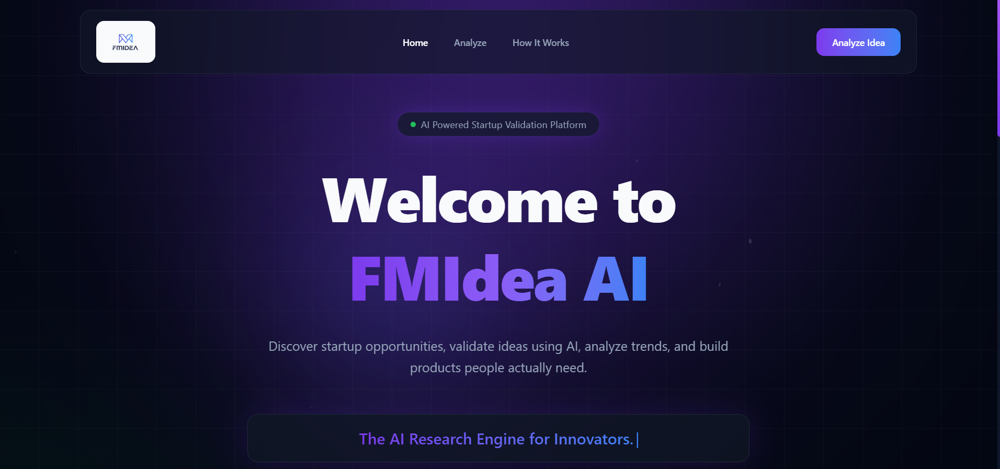

<div align="center">



# 🚀 FMIdea

### Transform Your Startup Idea Into a Complete Business Blueprint with AI

<p align="center">
An AI-powered startup validation platform that analyzes your idea, researches competitors, evaluates market potential, and generates a complete business strategy within minutes.
</p>

<p align="center">


</p>

🌐 **Live Demo:** https://fmidea.vercel.app/

</div>

---

# 🌟 Overview

Starting a startup is exciting...

But building the wrong product is expensive.

Most founders spend months building products before validating whether customers actually need them.

**FMIdea** eliminates that risk by providing an AI-powered startup validation system that transforms a simple idea into a complete startup report including market research, competitor analysis, SWOT analysis, revenue model, roadmap, technical architecture, and much more.

---

# ❓ Problem Statement

Thousands of startup founders fail because they build products without validating their ideas.

### Challenges

- ❌ No market research
- ❌ No competitor insights
- ❌ Poor business planning
- ❌ Weak revenue strategy
- ❌ No MVP roadmap
- ❌ Expensive trial-and-error
- ❌ Lack of technical guidance

This results in wasted time, money, and effort.

---

# 💡 Our Solution

FMIdea is an AI-powered Startup Validation Platform that helps entrepreneurs validate their startup ideas before development begins.

Simply describe your startup idea...

Our AI generates:

- 📊 Market Research
- 🏆 Competitor Analysis
- 📈 SWOT Analysis
- 💰 Revenue Model
- 🎯 Target Audience
- 🛠 Technical Architecture
- 🚀 MVP Roadmap
- 📢 Marketing Strategy
- ⚠ Risk Assessment
- 📄 Downloadable PDF Report

Everything within minutes.

---

# ✨ Features

| Feature | Description |
|----------|-------------|
| 🤖 AI Validation | Analyze startup ideas using Gemini AI |
| 📊 Market Research | Understand demand and trends |
| 🏆 Competitor Analysis | Discover existing competitors |
| 📈 SWOT Analysis | Strengths, Weaknesses, Opportunities & Threats |
| 💰 Revenue Model | Suggested monetization strategy |
| 🛠 Tech Stack Recommendation | Best technologies for implementation |
| 🚀 MVP Planning | Step-by-step development roadmap |
| 📄 PDF Export | Download complete startup report |
| 🎨 Modern UI | Beautiful and responsive interface |

---

# 🖥 Application Workflow

```text
                 User

                   │

                   ▼

          Startup Idea Form

                   │

                   ▼

          AI Validation Engine

                   │

        ┌──────────┴──────────┐

        ▼                     ▼

 Market Research      Competitor Search

        ▼                     ▼

 SWOT Analysis     Revenue Strategy

        ▼                     ▼

 Technical Plan     MVP Roadmap

        └──────────┬──────────┘

                   ▼

      Interactive Dashboard

                   ▼

           Export PDF Report
```

---

# 🏗 System Architecture

> Replace with your architecture image.

```md

```

---

# 📸 Application Screenshots

## 🏠 Landing Page


---

## 📝 Startup Form


---

## ⚡ AI Processing


---

## 📊 Validation Dashboard


---

## 📄 PDF Export


---

# ⚙ Tech Stack

## Frontend

- React
- Vite
- Tailwind CSS
- Framer Motion

## Backend

- Node.js
- Express.js

## AI

- Google Gemini API
- Tavily Search API

## Export

- jsPDF

## Deployment

- Vercel

---

# 📂 Folder Structure

```
FMIdea
│
├── client
├── server
├── components
├── pages
├── assets
├── docs
│   ├── home.png
│   ├── form.png
│   ├── dashboard.png
│   ├── analyze.png
│   ├── pdf.png
│   ├── workflow.png
│   └── architecture.png
└── README.md
```

---

# 🚀 Installation

```bash
git clone https://github.com/yourusername/fmidea

cd fmidea

npm install

npm run dev
```

---

# 🎯 Future Scope

- 🤝 Investor Matching
- 📈 Financial Forecasting
- 🧠 AI Pitch Deck Generator
- 💼 Team Matching
- 🌍 Multi-language Support
- 📊 Startup Success Score
- 📱 Mobile App
- 🔗 Integration with Startup Ecosystems

---

# 👨‍💻 Team

## 🚀 Code XIndian

Built with ❤️ during the **Impact Forge Summer 2026 Hackathon**.

---

# 🌐 Live Website

### https://fmidea.vercel.app/

---

# ❤️ Support

If you found this project useful,

⭐ **Give it a Star on GitHub**

It motivates us to build even better AI products.

---

<div align="center">

# 🚀 FMIdea

### "Validate Before You Build."

Made with ❤️ by **Code XIndian**

</div>
